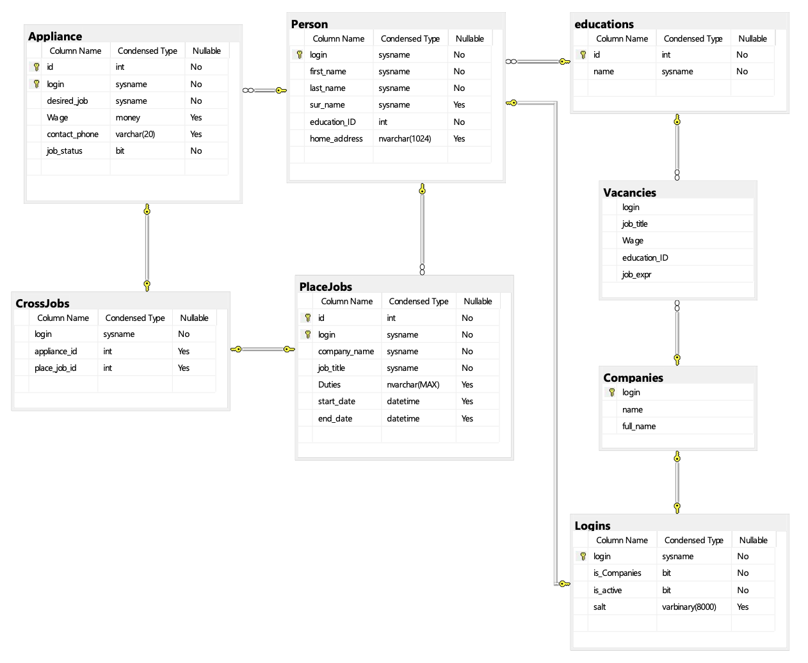

## Отчёт по первому этапу 
## Махова Александра Михайловича, 327 группа 

## Вариант 7 (Кадровое агентство) 

Предполагается, что разработанное веб-приложение будет использоваться как система сопровождения работы кадрового агенства.

Функционал приложения обеспечивает систему управления информацией о вакансиях и резюме.

Поддерживаемые типы данных: 

- Люди

  - Фамилия
  - Имя
  - Отчество
  - Образование
  - Домашний адрес
  - История работы: компании, должности (обязанности), зарплаты
  - Статус: ищет работу или нет, если ищет, какие условия (должность, зарплата)

- Компании

  - Название
  - Вакансии: должность + предлагаемая зарплата + требования к образованию и послужному списку

### Список страниц

1. Страница входа
Содержит: 
	- Поле "Логин"
	- Поле "Пароль"
	- Поле "Вход/Регистрация"
	- Чекбокс "Новый пользователь"
	- Чекбокс "Соискатель/Работодатель", доступный при выборе чекбокса "Новый пользователь"
	- Кнопка "Войти" или кнопка "Зарегистрироваться" при выборе чекбокса "Новый пользователь"

2. Страница регистрации работодателя
Содержит:
	- Поле "Имя компании"
	- Поле "Краткое имя компании"
	- Кнопка "Продолжить"
	- Кнопка "Отменить"

3. Страница регистрации работника
Содержит:
	- Поле "Имя"
	- Поле "Фамилия"
	- Поле "Отчество" – поле не обязательно к заполнению
	- Выпадающий список "Образование" – содержит доступные варианты для графы "Образование" – от "Не указано" до "Доктор наук"
	- Поле "Домашний адрес" – не обязательно к заполнению
	- Кнопка "Продолжить"
	- Кнопка "Отменить"

3. Страница личного кабинета компании
Содержит:
	- Поле "Краткое имя компании"
	- Поле "Полное имя компании"
	- Кнопки "Изменить" около предыдущих двух полей
	- Кнопка "Выйти"
	- Кнопка "Удалить аккаунт"
	- Список вакансий компании
	- Кнопка "Добавить/Редактировать" в списке вакансий
	- Кнопка "Удалить" в списке вакансий
	- Кнопка "Поиск резюме"

4. Страница личного кабинета работника
Содержит:
	- Поле "Имя"
	- Поле "Фамилия"
	- Поле "Отчество" – поле не обязательно к заполнению
	- Выпадающий список "Образование"
	- Поле "Домашний адрес" – поле не обязательно к заполнению
	- Кнопки "Изменить" около предыдущих пяти полей
	- Кнопка "Выйти"
	- Кнопка "Удалить аккаунт"
	- Список предыдущих мест работ
	- Кнопка "Добавить/Редактировать" в списке работ
	- Кнопка "Удалить" в списке работ
	- Список составленных резюме
	- Кнопка "Добавить/Редактировать" в списке резюме
	- Кнопка "Удалить" в списке резюме
	- Кнопка "Поиск вакансий"

5. Страница добавления/редактирования вакансии
Содержит:
	- Поле "Должность"
	- Поле "Зарплата" – поле не обязательно к заполнению
	- Выпадающий список "Образование"
	- Поле "Опыт работы" – поле не обязательно к заполнению, ≥0
	- Кнопка "Сохранить"
	- Кнопка "Отменить"
	- Кнопка "Выйти"
	- Кнопка "Личный кабинет"

6. Страница добавления/редактирования мест работ
Содержит:
	- Поле "Имя компании"
	- Поле "Должность"
	- Поле "Обязанности" – поле не обязательно к заполнению
	- Поле "Дата начала работы"
	- Поле "Дата конца работы" – поле не обязательно к заполнению, в этом случае подразумевается что человек работает в этом месте по настоящее время
	- Кнопка "Сохранить"
	- Кнопка "Отменить"
	- Кнопка "Выйти"
	- Кнопка "Личный кабинет"

7. Страница добавления/редактирования резюме
Содержит:
	- Поле "Желаемая должность"
	- Поле "Зарплата" – поле не обязательно к заполнению, в этом случае подразумевается договорная заработная плата
	- Поле "Контактный номер телефона"
	- Поле "Статус работы" – ищет ли человек в данный момент работу или нет
	- Список мест работ, позволяющий отметить чекбоксом предыдущие места работы, которые необходимо добавить к этой вакансии
	- Кнопка "Сохранить"
	- Кнопка "Отменить"
	- Кнопка "Выйти"
	- Кнопка "Личный кабинет"

8. Страница поиска резюме (для компаний)
Содержит:
	- Поле "Образование"
	- Поле "Предыдущие места работы"
	- Поле "Предыдущие должности"
	- Поле "Предыдущая зарплата"
	- Чекбоксы рядом с предыдущими четырьмя полями, которые позволяют вносить изменения в эти поля и активируют их при поиске
	- Кнопка "Поиск"
	- Кнопка "Выйти"
	- Кнопка "Личный кабинет"
	- Список резюме, найденных при поиске
	- Кнопка "Детальная информация" напротив каждого резюме

9. Страница поиска вакансий (для работников)
Содержит
	- Поле "Компания"
	- Поле "Должность"
	- Поле "Зарплата"
	- Чекбоксы рядом с предыдущими тремя полями, которые позволяют вносить изменения в эти поля и активируют их при поиске
	- Кнопка "Поиск"
	- Кнопка "Выйти"
	- Кнопка "Личный кабинет"
	- Список вакансий, найденных при поиске
	- Кнопка "Детальная информация" напротив каждой вакансии

10. Страница детальной информации
Содержит все поля от вакансии, резюме или предыдущем месте работы, эта страница доступна при нажатии кнопки "Детальная информация". Также, аналогично остальным страницам (кроме страницы входа), имеются кнопки "Выйти" и "Личный кабинет". При просмотре резюме такая же кнопка есть у каждого места работы в списке прикрепленных к резюме мест работ.

### Сценарии использования

1. Страница входа:
    На странице входа имеются поля: логин и пароль, также имеется чекбокс – «Новый пользователь», по умолчанию не установлен, что говорит о наличии пользователя в системе. В случае установки чекбокса появляется возможность выделить тип пользователя: работодатель или соискатель. 
    
    
    У страницы входа соответственно есть кнопка «Вход»/«Регистрация» – кнопка меняется в зависимости от выделенного чекбокса «Новый пользователь». В случае регистрации работодателя отображается страница регистрации компании. В случае регистрации соискателя отображается страница регистрации работника. При входе/регистрации на сайт пользователь в обоих случаях обязан предоставить уникальный логин и пароль на странице входа/регистрации, заполнив соответствующие поля.

2. Страница регистрации работодателя содержит поля ввода для полей: «Имя компании», «Краткое имя компании», которые необходимо заполнить для продолжения. Затем необходимо завершить регистрацию нажатием кнопки "Продолжить" или отменить ее, нажатием кнопки "Отменить".

3. Страница регистрации соискателя содержит поля для заполнения: «Имя», «Фамилия», «Отчество» (не обязательно), «Образование» – выпадающий список из доступных вариантов, «Домашний адрес» (не обязательно), которые необходимо заполнить для продолжения (кроме необязательных полей). Затем необходимо завершить регистрацию нажатием кнопки "Продолжить" или отменить ее, нажатием кнопки "Отменить".

4. После регистрации клиент попадает на соответствующие страницы поиска.

5. Страница поиска резюме для компании имеет следующие сценарии использования:

   Возможно получить спискок резюме по образованию, компаниям, в которых люди работали, по занимавшимся должностям, зарплатам – за это отвечают соответствующие чекбоксы и поля. 

   Далее пользователь может выбрать интересующее резюме по кнопке «Детальная информация». В выбранном резюме видна детальная информация о нем и о человеке, в том числе возможно просмотреть историю работ для данного человека нажав кнопку "Детальная информация" рядом с конкретным местом работы из списка.

6. Страница поиска вакансий для соискателей имеет следующие сценарии использования: Возможно получение списка вакансий по компаниям, должностям, зарплатам – за это отвечают соответствующие чекбоксы и поля. Результаты появляются в соответствующем списке на странице. 

   Далее пользователь может выбрать интересующую вакансию по кнопке «Детальная информация». В выбранной вакансии видна детальная информация о ней и о компании.

7. На любой странице, кроме страниц входа, регистрации и личного кабинета, есть кнопка "Личный кабинет", которая отменяет любые несохраненные изменения и отправляет пользователя на страницу личного кабинета.

8. Страница личного кабинета работодателя содержит данные о самой компании – «Краткое имя компании», «Имя компании» – поля, которые при желании можно изменить, нажав соответствующую полю кнопку «Изменить». Также можно удалить аккаунт компании целиком вместе со всеми созданными вакансиями нажав кнопку «Удалить аккаунт» и подтвердив удаление.
   

   Со страницы личного кабинета работодателя можно перейти на страницу поиска резюме по нажатию соответствующей кнопки.
   
   
   Страница личного кабинета также отображает список вакансий компании, с помощью кнопки «Добавить»/«Редактировать» можно добавить или редактировать вакансию, с помощью кнопки «Удалить» – удалить выбранную вакансию. 
   
   
   При нажатии кнопки «Добавить»/«Редактировать» – мы переходим на страницу добавления/редактирования вакансии. Заполнив или изменив уже заполненные поля «Должность», «Зарплата» (не обязательно), «Образование» – выпадающий список из доступных значений, «Опыт работы» (не обязательно, ≥ 0) можно сохранить изменения по нажатию кнопки «Сохранить», отменить изменения по нажатию кнопки «Отменить».

9. Личный кабинет соискателя содержит информацию о соискателе: поля «Имя», «Фамилия», «Отчество» (не обязательно), «Образование», «Домашний адрес» (не обязательно), которые при желании можно изменить, нажав соответствующую полю кнопку «Изменить», затем введя новое значение и подтвердив изменение. 

   Также в личном кабинете есть список предыдущих мест работ, который можно изменить по аналогии с выше описанным списком вакансий в личном кабинете работодателя.

   Также можно удалить аккаунт соискателя целиком вместе со всеми созданными резюме и местами работы нажав кнопку «Удалить аккаунт» и подтвердив удаление.

   
   Страница личного кабинета также отображает список резюме, который можно изменять: добавлять/редактировать и удалять существующие резюме. Резюме содержит поля: «Желаемая должность», «Зарплата» (не обязательно, в случае отсутствия считается договорной), «Контактный номер телефона», «Статус работы». Также имеется список из уже существующих записей о предыдущих местах работы, которые можно отметить чекбоксом для добавления к резюме.

10. На любой странице, кроме страниц входа и регистрации, есть кнопка «Выйти», которая отменяет любые несохраненные изменения и отправляет пользователя на страницу входа.

### Схема БД

